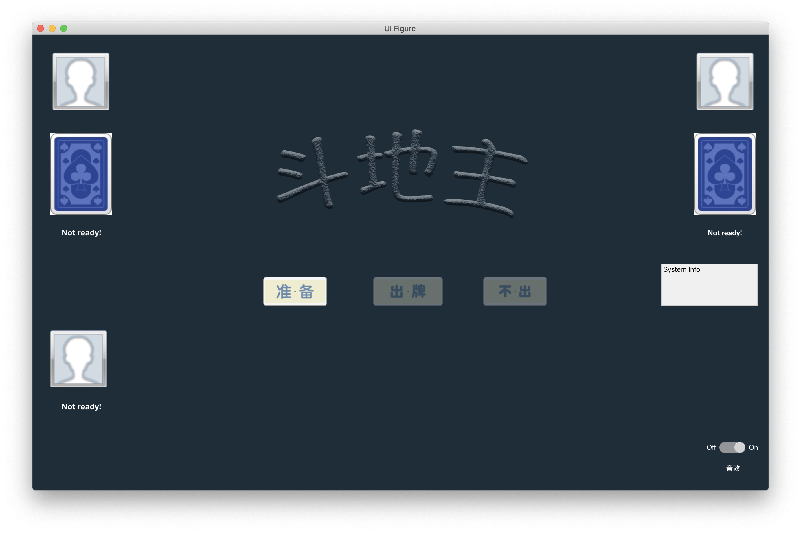
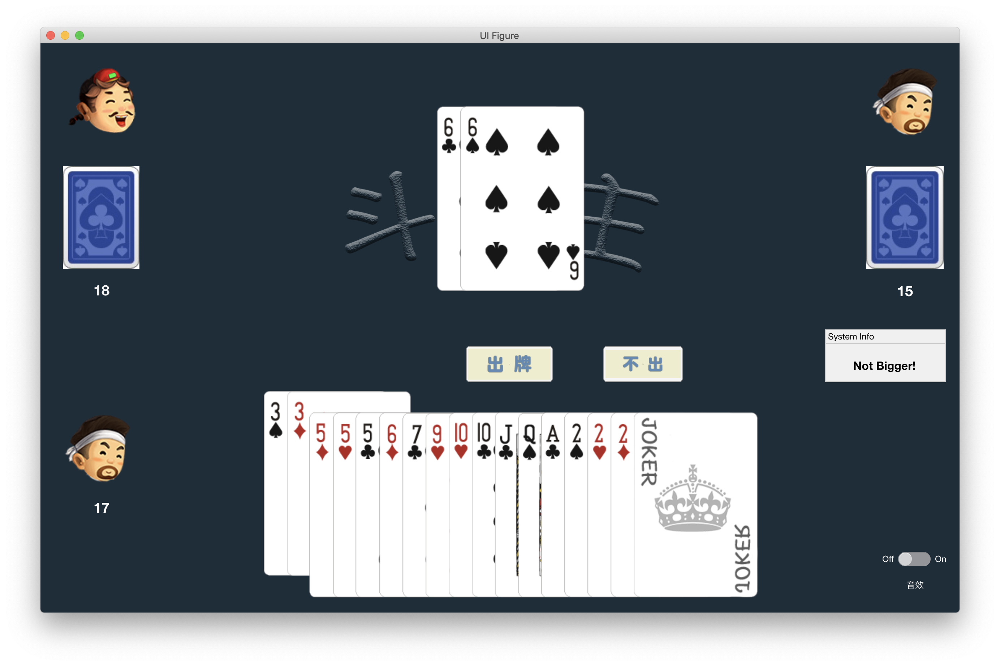

# Dou Dizhu

One of the final projects of CS132. Dou dizhu(a poker game) made by MATLAB(2019_a).   
Since the MATLAB is required by professor, I have to develop this app using a unfamiliar language. Though MATLAB does not a good choice for developing app, the appdesigner, a tool provided by MATLAB, is powerful in desigh and easy to use.  

**Note:** We have provided a complete documents(requirements, software specifications, validations e.t.c) for this project, please check `<./docs>` first if you have any puzzles. 

## Requirements
+ **MATLAB 2019_a** or **higher**

## Usage
1. In MATLAB, change current folder to the one _main.m_ is in.
2. add `<./resourse>`, `<./resourse/cards>`, `<./resourse/audio_mat>` to your **MATLAB PATH**.
3. Run:
   1. Type `main` in console **or** 
   2. Double click the file `main.m` and lick `Run` in the `Editor` Tab.
   
## Test
 Copy all `<*.m>` files within `<./test>` to the main path. All can select any test file and run it.  
 Specially, the `<./test/ruleTest.m>` contains two games. If you run it, it will play two games automatically.

## Docs
1. **Requirements**: All requirements of Dou Dizhu. This doc includes UML, rules,requirement prioritization e.t.c. 
2. **Wiki:** Dowload from wikipedia, as reference.
3. **Specification:** Develop details. If you hava any questions about implementation please refer to this. 
4. **Validation:** Test reports.
   
## TODO
Within the limited develop time, the app is not very complete. At present, the app can support play _Dou Dizhu_ in one PC. Following is TODO list. If you can contribute to this Repo, I'll be really appreciated. 
1. [ ] Log In
2. [ ] "叫地主"
3. [ ] “提示”
4. [ ] 人-机模式
5. [ ] 托管
6. [ ] More voice effects during the playing: some audio files has put in `<./resourse/audio/>`.
7. [ ] Timer
8. [ ] Restart 
9. [ ] Settings
10. [ ] Database

## Contributors
+ Requirtment: [Candlend](https://github.com/Candlend)
+ Deleloper: [Gideon Weng](https://github.com/GideonWeng)
+ Validation: [Wyattwwwww](https://github.com/Wyattwwwww)  

I wanna share great gratitude to my partners. Without their contribution, I cannot finish the project in such a limited time. 

## Contributing 
Please Feel free to send a [pull request](https://github.com/GideonWeng/Doudizhu/pulls) to contribute to this repository. If you have any suggestions or problems please [new issue](https://github.com/GideonWeng/Doudizhu/issues) or [email](cnzxwgy@gmail.com) me.